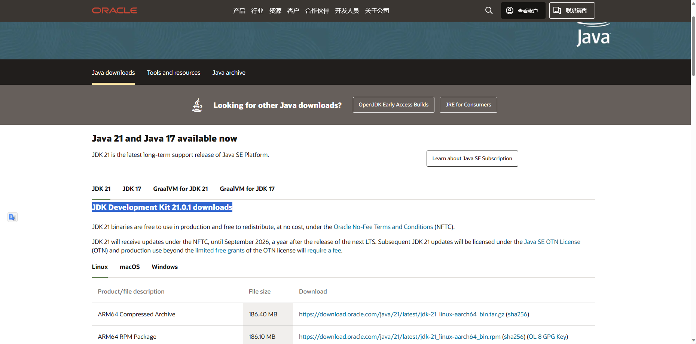

--- 
title: 简介
icon: /assets/icon/basic.svg
order: 1
category: 
  - Java
  - Java SE
tag:
  - 基础
isOriginal: true
---

## Java 简介

Java 是 Sun 公司 1995 年推出的编程语言，2009 年被 Oracle 收购。

### Java 体系

- Java SE：Java 标准版，包括 Java 的基本语法和常见工具类的封装。
- Jakarta ee：Java 企业版，甲骨文将 Java EE 移交给 Eclipse 基金会，最终更名为 Jakarta EE。

:::tip Java ME
还有一个已经被淘汰的微型版本。
:::

### 主要特性

- 简单：相比较于 C 或者 C++，移除了复杂语法，比如指针、多继承。
- 面向对象。
- 安全

### 历史发展

Java 的历史发展可以通过 Java 的版本进行查看，从 Java 1.0 开始，到 Java 1.8 更名为 Java 8，如今最新版本为 Java 22。

## JDK

JDK 是 (Java Development Kit) 的缩写，包含 JRE 和常用工具。

### Oracle JDK 和 Open JDK

两者的差距很小，因为无需纠结需要使用哪个，在企业中建议使用 Open JDK，因为是免费开源的。

### JDK 版本

JDK 可以分为长期支持版本和临时版本，长期支持版本有 8，11，17，21。

推荐选择 21，因为 Java 现在的发展是去 8，而 Java 21 相比较于 Java 17，虚拟进程给的性能更加有优势。

### JRE

JRE 是（Java Runtime Environment）的缩写，包括基本类库和 Java 虚拟机，只需要运行 Java 程序则只安装 JRE 即可。

### JVM

JVM 是 Java 虚拟机（Java Virtual Machine）的缩写。它是一种虚拟的计算机，能够运行 Java 程序，并将 Java 代码转换为字节码，从而实现在不同的计算机平台上运行相同的 Java 程序。JVM 是 Java 程序运行的核心组件，负责管理内存、执行字节码等功能。

## JDK 的安装

### Windows 的安装

在 [Oracle官网](https://www.oracle.com/cn/java/technologies/downloads/) 中进行下载。

选择自己的版本和合适的包。



选择压缩包安装，如果选择exe和msi安装直接下一步即可。

解压之后设置环境变量：

需要添加一个 JAVA_HOME 的系统变量，值为 Java 的文件夹地址。path 变量需要添加一条记录：`%JAVA_HOME\bin`。

使用命令提示符输入`java -version`查看是否可以运行。

### Linux 的安装

```sh
# 创建文件夹并进入文件夹
mkdir /usr/local/java
cd /usr/local/java
# 下载压缩包
wget https://download.oracle.com/graalvm/21/latest/graalvm-jdk-21_linux-x64_bin.tar.gz
# 解压压缩包
tar -xvf graalvm-jdk-21_linux-x64_bin.tar.gz
# 打开 profile 设置环境变量
vi /etc/profile
# 填写环境变量
export JAVA_HOME=/usr/local/java/graalvm-jdk-21_linux-x64_bin
export PATH=$JAVA_HOME/bin:$PATH
export CLASSPATH=.:$JAVA_HOME/lib/dt.jar:$JAVA_HOME/lib/tools.jar
# 环境变量生效
source /etc/profile
```

## Hello World

创建一个 HelloWorld.java 的文本文件，通过记事本打开，输入以下代码。

```java
public class HelloWorld{
    public static void main(String[] args) {
        System.out.println("Hello World");
    }
}
```

打开命令提示符输入以下命令进行编译[^1]。

[^1]: 最新的编译方式是使用 `java HelloWorld.java`

```shell
javac HelloWorld.java
java HelloWorld
```

### 最新 HelloWorld 文件

```java
void main(){
    System.out.println("Hello World");
}
```

通过 `java --enable-preview --source 21 HelloWorld.java` 来运行。

### 第一行代码
`public class 类名 {}` 这一样表明是一个类，其中类名必须要和文件名相同。

### 第二行代码

`public static void main(String[] args) {}`

标准格式，其中的args可以改变，但是args表示是参数，有其特殊含义，因此不建议改变。String[] 定义一个数组，可以采用 `C++` 的写法，但是不建议。


### 第三行代码

`System.out.println("Hello World");` 一个标准的输出语法，println表示一个换行，输出一行 Hello World。

<Share colorful />