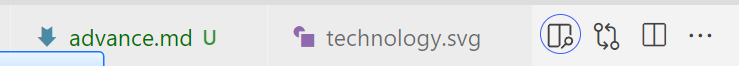
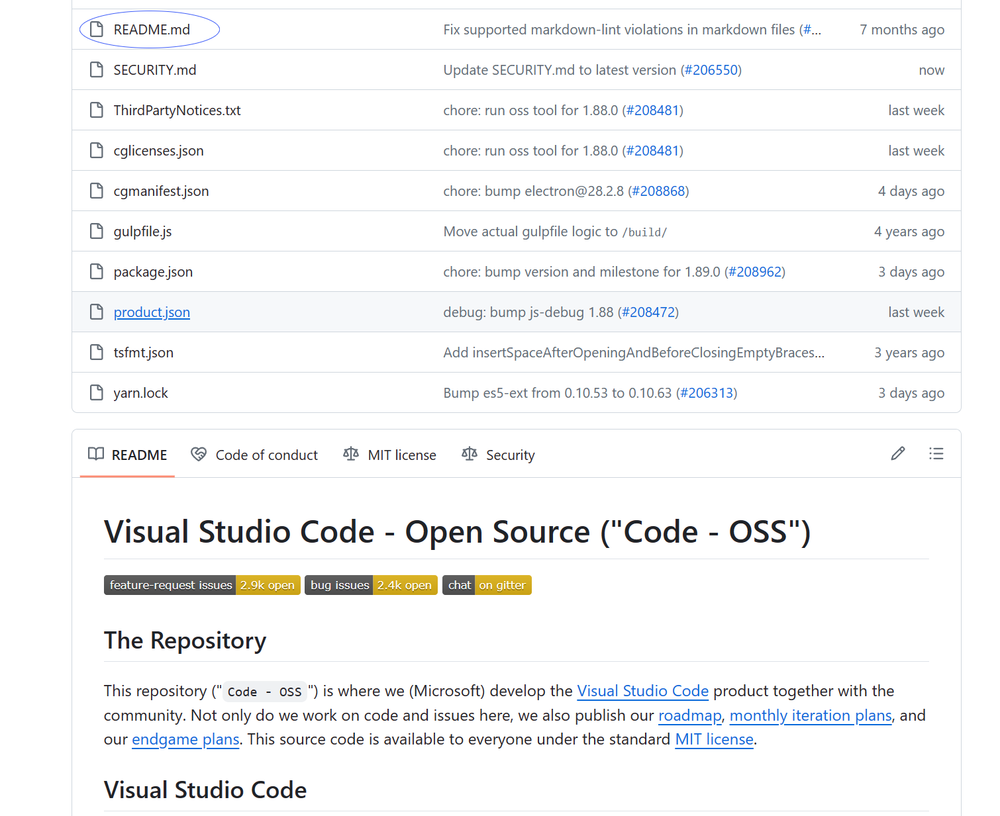

--- 
title: 基础
icon: /assets/icon/basic.svg
order: 1
category: 
  - 实用技术
  - Markdown
tag:
  - 基础
isOriginal: true
---

## 简介

Markdown 是一种轻量级的标记语言，将普通文本转换成 HTML 文档，因此 markdown 文档可以直接使用 HTML 语句。其后缀名为 `.md`。

### 常用工具

建议使用 VS Code 或者 Typora 来进行使用。

VS Code 中推荐使用插件 [Markdown Preview Enhanced](https://marketplace.visualstudio.com/items?itemName=shd101wyy.markdown-preview-enhanced) 、[Markdown Preview Github Styling](https://marketplace.visualstudio.com/items?itemName=bierner.markdown-preview-github-styles) 和 [Markdown All in One](https://marketplace.visualstudio.com/items?itemName=yzhang.markdown-all-in-one)。

通过 VS Code 打开 Markdown 文件并下载插件后，通过打开侧边预览进行查看。



### 使用场景

知乎、博客园、钉钉个人版和 Loop 等软件都支持 Markdown 语法。

GitHub 和 GitLab 等仓库主页通过 README.md 文件来对项目进行展示。



## 基本语法

### 标题

标题可以通过添加添加 # 来添加。一级标题为 1 个 #，六级标题为 6 个 #。建议一级标题只使用一个。

建议在 # 和后续的文本之间使用空格来进行分隔。

```md
# 一级标题

## 二级标题

### 三级标题

#### 四级标题

##### 五级标题

###### 六级标题
```

演示效果：

> # 一级标题
> 
> ## 二级标题
> 
> ### 三级标题
> 
> #### 四级标题
> 
> ##### 五级标题
> 
> ###### 六级标题

:::tip 另一种设置标题的方法
这种不常用，在其下添加 `---` 或者 `===`，前者为二级标题，后者为一级标题。

不建议使用这种，因为可能和下划线混淆。
:::

### 段落和换行

换行使用一个回车进行换行。

Markdown中的段落不建议使用中文中习惯的首行缩进，直接使用两个以上回车进行分隔。


```md
第一段第一行
第二行

第二段
```

演示效果：

> 第一段第一行
> 第二行
> 
> 第二段

### 特殊语法

主要有三种特殊语法，斜体、加粗和粗斜体。

| 名称  | 格式          |
|-----|-------------|
| 斜体  | \*文本*       |
| 粗体  | \*\*文本**    |
| 粗斜体 | \*\*\*文本*** |
|分割线|---|

```md
*斜体*，**粗体**，***粗斜体***

---
```

演示效果：

> *斜体*，**粗体**，***粗斜体***
> 
> ---  

### 引用

创建引用需要在段落前添加 \>。

块引用也可以进行嵌套。

```md
> 这是一个引用

>嵌套语法
>
> > 第二层引用
> # 一个一级标题
```

演示效果：

> 这是一个引用

> 嵌套语法
>
> > 第二层引用
> # 一个一级标题

### 代码

使用反引号进行包裹便可表示为代码。

```md
`代码`
```

演示效果：

> `代码` 未包裹

### 链接

链接文本在中括号内，地址在后面的括号中，引用包裹的内容是提示文本。

```md
[百度](https://www.baidu.com "百度一下你就知道")
```

### 图片

图片相比较于连接，只是添加了一个 !。

```md

```

>

### 转义字符

当某些字符需要按照原本的内容来显示时，需要使用转移字符\来对字符进行转移。

```md
\
```

演示效果：

> \

如果你需要添加多个空格，由于 HTML 的限制，多个空格并不能展示出来。

```md
如果      这是什么
```

演示效果： 
> 如果      这是什么

因此需要添加特殊字符转义。

```md
如果&nbsp;&nbsp;&nbsp;&nbsp;这是什么
```

> 如果&nbsp;&nbsp;&nbsp;&nbsp;这是什么